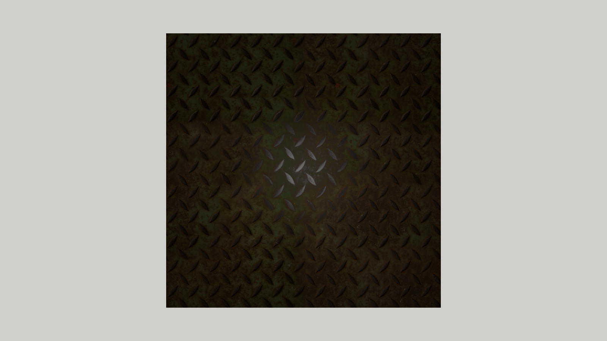

# Blinn-Phong textures

So far only the diffuse color `Kd` could be taken from a texture (`map_Kd`). In this assignment, we will do the same
for the remaining parameters of the Blinn-Phong material: the ambient color `Ka`, the specular color `Ks` and the
shininess `Ns`. In MTL files the corresponding textures are given by the `map_Ka`, `map_Ks` and `map_Ns` statements.
This way the surface can, e.g., be shiny in some places and dull in others.

Start by copying the `15_ob_BlinnPhongSpecular` assignment to a new `15_oc_BlinnPhongTextures` directory, as
described in the [Preparing the assignments](../README.md#preparing-the-assignments) section.

## The model

We will use the textures of a metal plate from the `Models/metal_plate/textures` directory. The `Models` directory
contains the model `square_textures.obj`, the same square as in `square_specular.obj`, with the material
`square_textures.mtl`:

```
newmtl MetalPlate
Ka 1.0 1.0 1.0
Kd 1.0 1.0 1.0
Ks 0.22 0.22 0.22
Ns 100.0
map_Kd metal_plate/textures/metal_plate_diff_1k.png
map_Ka metal_plate/textures/metal_plate_diff_1k.png
map_Ks metal_plate/textures/metal_plate_spec_1k.png
map_Ns metal_plate/textures/ns0001.png
illum 2
```

The texture names are relative to the directory of the MTL file. Each texture is multiplied by the corresponding
parameter. `Ka` and `Kd` are white, so these colors are taken from the textures only.

`Ks` and `Ns` are much smaller than for the polished metal of the previous assignment. The plate is painted and
rusted, so its surface is rough, which means a small shininess and a wide, dim highlight. And it is not a metal:
paint and rust reflect specularly only about 4% of the light, so `Ks` is well below one. Remember that the colors in
the MTL file are in sRGB, so `Ks 0.22` becomes 0.04 after the conversion to linear space. The textures then make
both even smaller in places: `map_Ks` darkens the specular color, and `map_Ns` scales `Ns` to between about 40
and 90.

1. In the `init` method of `SimpleShapeApplication` load `square_textures.obj` instead of `square_specular.obj`.
   As `BlinnPhongMaterial` already handles `map_Kd`, you should see the plate, with a wide and dim specular
   highlight on top of it.

   The pattern of the plate will be washed out and barely visible. This is expected at this stage: the material has
   `Ka` equal to white, and until `map_Ka` is handled the ambient term is a flat color, `Ka` times the ambient light,
   which is much brighter than the light reflected from the dark diffuse texture. It will go away when we add the
   ambient texture below.

## Textures with any number of channels

The specular texture `metal_plate_spec_1k.png` and the shininess texture `ns0001.png` are grayscale images with only
one channel, while our `create_texture` function handles only images with three or four channels. The easiest way to
handle them is to ask `stbi_load` to convert the image to the number of channels we want: this is what its last
argument, `desired_channels`, is for. When it is zero, as so far, the image is loaded with its own number of channels.
A grayscale image converted to four channels has the gray value in the red, green and blue channels and an opaque alpha.
The specular texture, like the diffuse one, also has 16 bits per channel; `stbi_load` always returns 8 bits per
channel, so it is converted automatically.

1. Add a third parameter to the `create_texture` function
   ```c++
   gl::Texture create_texture(const std::string &name, bool is_sRGB = true, int desired_channels = 0);
   ```
   and pass it to `stbi_load` as the last argument.

2. When `desired_channels` is not zero, `stbi_load` still returns the number of channels of the _file_ in its
   `channels` argument, but the data has `desired_channels` channels. So use `desired_channels`, when it is not
   zero, to choose the internal format for `glTextureStorage2D` and the format of the data for
   `glTextureSubImage2D`. If the data has neither three nor four channels, print an error
   message saying that only three or four channels are supported and return an empty handle, as when the image
   cannot be read.

## Material

1. Add three fields of type `GLuint` to the `BlinnPhongMaterial` class: `map_Ka_`, `map_Ks_` and `map_Ns_`, all
   initialized to zero, with the setters `set_map_Ka`, `set_map_Ks` and `set_map_Ns`, written like the `set_texture`
   setter of the diffuse texture. For consistency you can also rename the diffuse texture field and its setter, which
   `BlinnPhongMaterial` got when it was copied from `KdMaterial`, to `map_Kd_` and `set_map_Kd`, as in the reference
   solution; then update the `set_texture` call in `create_from_mtl` too.

2. In the `create_from_mtl` method load the textures, in the same way as the diffuse texture. In the
   `mtl_material_t` structure their names are `ambient_texname`, `specular_texname` and `specular_highlight_texname`
   (`map_Ns` is called the _specular highlight_ map). Load all three with four channels, and change the loading of
   the diffuse texture to four channels too, so that a grayscale image can be used for any of them.

   The material owns the textures it loads, as the diffuse one in the `13_OBJReader` assignment. Now there can be up
   to four of them, so replace the `map_Kd_texture_` field by a vector of owners
   ```c++
   std::vector<gl::Texture> owned_textures_;
   ```
   (include `<vector>` in `BlinnPhongMaterial.h`), and move every texture loaded in `create_from_mtl`, the diffuse one
   included, into it:
   ```c++
   if (texture) {
       material->set_map_Ks(texture.get());
       material->owned_textures_.push_back(std::move(texture));
   }
   ```
   The vector deletes all of them when the material is deleted. A `gl::Texture` cannot be copied, so `push_back`
   needs `std::move`; without it the code does not compile. Textures passed in through the setters still belong to the
   caller and are not added to this vector.

   Think about which of them are in the sRGB color space. The ambient and specular textures are colors, like the
   diffuse texture, so they are sRGB. The shininess texture is not a color, it contains numbers that multiply `Ns`, so
   it must not be converted: load it with `is_sRGB` set to `false`.

3. In the fragment shader add three samplers
   ```glsl
   uniform sampler2D map_Ks;
   uniform sampler2D map_Ka;
   uniform sampler2D map_Ns;
   ```
   Each sampler must be connected to a different texture unit. `map_Kd` uses unit 0, so use units 1, 2 and 3 for
   `map_Ks`, `map_Ka` and `map_Ns`. As for `map_Kd`, whose location is kept in `map_Kd_location_`, add static
   fields for the locations of these uniforms to the `BlinnPhongMaterial` class
   ```c++
   inline static GLint map_Ks_location_ = -1;
   inline static GLint map_Ka_location_ = -1;
   inline static GLint map_Ns_location_ = -1;
   ```
   and set them in the `init` method using `glGetUniformLocation`.

4. In the `bind` method, for each of these textures that is present (handle greater than zero), assign its unit to
   the sampler with `glUniform1i` and bind the texture to the unit with `glBindTextureUnit(unit, texture)`, as for
   `map_Kd`. In the `unbind` method unbind each of them from its unit with `glBindTextureUnit(unit, 0)`.

   Samplers are initialized to unit 0, so a forgotten `glUniform1i` makes the sampler read the diffuse texture,
   which is hard to notice. Check the locations: `glGetUniformLocation` returns -1 if the uniform is not used in the
   shader.

5. As with `use_map_Kd`, the shader has to know which textures are present. Add three `bool` fields `use_map_Ks`,
   `use_map_Ka` and `use_map_Ns` at the end of the `BlinnPhongMaterial` interface block, after `illum`. They are at
   offsets 64, 68 and 72, so increase the size of the buffer to `5*sizeof(glm::vec4)`, i.e. 80 bytes, and load them in
   the `bind` method. As before, you can check the offsets using `uniform_info`.

## Shader

Now use the textures in the fragment shader. Each texture multiplies the corresponding parameter:

1. The ambient color
   ```glsl
   vec3 ambient_color = Ka.rgb;
   if (use_map_Ka) {
       ambient_color *= texture(map_Ka, vertex_texcoord_0).rgb;
   }
   ```
   and use `ambient_color` instead of `Ka.rgb` when computing the ambient term.

2. In the same way compute `specular_color` from `Ks` and `map_Ks`, and use it instead of `Ks.rgb` in the specular
   term.

3. The shininess is a single number, so use only the red channel of the texture:
   ```glsl
   float shininess = Ns;
   if (use_map_Ns) {
       shininess *= texture(map_Ns, vertex_texcoord_0).r;
   }
   ```
   and use `shininess` instead of `Ns` in the specular term, also in the `(shininess + 8.0) * INV_PI_8`
   normalization factor.

   The result should look like this:

   <p align="center"></p>

   The plate is dark and the highlight is a wide, dim glow in the middle. It is not uniform: the specular and shininess
textures change across the surface, so the raised diamonds of the pattern reflect more than the rusted surface
between them.

4. Check the effect of each texture by commenting out its line in `square_textures.mtl` (with `#`), one at a time.
   Without `map_Ns` the shininess is `Ns` = 100 everywhere instead of about 40 to 90, so the highlight becomes only
   slightly smaller. The difference is hard to see, and the pattern stays, because it comes mostly from the specular
   texture. Without `map_Ks` the highlight becomes much brighter, because the specular texture makes the specular
   color darker than `Ks`, and its middle becomes a smooth disk. The pattern is left only at its edges, where the
   shininess from `map_Ns` decides how fast the highlight fades.
