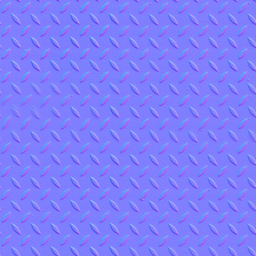
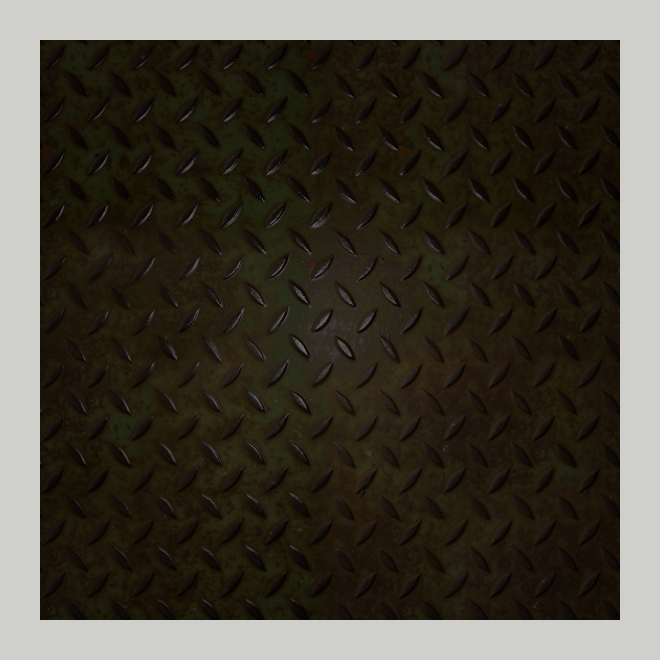

# Normal maps

The metal plate from the previous assignment is flat: the diamond pattern is only painted on it. In this assignment, we
will make the pattern react to the light as if it were raised, without changing the geometry. To do this we will
change the _normal_ used in the lighting calculations at each fragment, taking it from a texture called a _normal map_.

Start by copying the `15_oc_BlinnPhongTextures` assignment to a new `15_od_BlinnPhongNormalMap` directory, as
described in the [Preparing the assignments](../README.md#preparing-the-assignments) section.

## Normal maps and the tangent space

In MTL files such a texture is given by the `bump` (or `map_Bump`) statement. The `Models` directory contains the
model `square_normal_map.obj`, the square from the previous assignment, with the material `square_normal_map.mtl`.
The material is the same as `square_textures.mtl`, with one more line:

```
bump metal_plate/textures/metal_plate_nor_gl_1k.png
```

Despite the name of the statement, `metal_plate_nor_gl_1k.png` is not a bump (height) map but a _normal map_: each
pixel stores a unit vector `n`. Its components are in the range [-1,1], while the colors of a texture are in the
range [0,1], so each component is mapped to a color component, `x` to red, `y` to green and `z` to blue, by

```
color = (n + 1) / 2
```

and the shader recovers the vector by the inverse mapping

```
n = 2 * color - 1
```

In an image with 8 bits per channel the stored values are `round(255 * (n + 1) / 2)`, but the sampler divides
them by 255, so in the shader `color` is again in the range [0,1]. (`metal_plate_nor_gl_1k.png` has 16 bits per
channel, but `stbi_load` converts it to 8.) The vectors are given in the _tangent space_ of
the surface, whose axes are

- the _tangent_ `T`, the direction in which the texture coordinate `u` grows,
- the _bitangent_ `B`, the direction in which `v` grows,
- the normal `N` of the surface.

A normal map that does not change the normal stores (0,0,1) everywhere, i.e. the color (0.5,0.5,1). That is why
normal maps look bluish, as does the normal map of the metal plate (reduced to 256x256 pixels):

<p align="center"></p>

The flat parts of the plate are uniformly blue. On the slopes of the diamonds the normals tilt, which changes the red
and green components. Storing the normals in the tangent space means that the same texture can be used whatever the
orientation and the shape of the surface. The `_gl` suffix means that the map follows the OpenGL convention, in which
the `y` (green) component points along `B`, the direction of growing `v`. In the DirectX convention it points the other
way.

To use the normal map, the shader needs the tangent space at each fragment. `N` we already have. The tangents are
computed by the OBJ loader, using the [MikkTSpace](http://www.mikktspace.com/) algorithm, which is the convention used
by the programs that create normal maps (it is described in M. S. Mikkelsen,
[_Simulation of Wrinkled Surfaces Revisited_](https://web.archive.org/web/20150605042548/http://image.diku.dk/projects/media/morten.mikkelsen.08.pdf),
master's thesis, University of Copenhagen, 2008). They are sent as the vertex attribute `AttributeType::TANGENT`, i.e.
at location 2, of type `vec4`: the `xyz` components are the tangent `T`, and the `w` component, equal to 1 or -1, gives
the orientation of the bitangent:

```glsl
vec3 B = w * cross(N, T);
```

The bitangent is not stored, because it can be computed in this way.

1. In the `init` method of `SimpleShapeApplication` load `square_normal_map.obj` instead of `square_textures.obj`.
   Nothing should change yet.

## Material

1. Add a `GLuint map_bump_` field, initialized to zero, to the `BlinnPhongMaterial` class, and load it in the
   `create_from_mtl` method from the `bump_texname` field of `mtl_material_t`. The normal map is not a color, so load
   it with `is_sRGB` set to `false`, and with three channels. Move it into `owned_textures_`, like the other textures
   loaded there, so that it is deleted together with the material.

2. In the fragment shader add a sampler `uniform sampler2D map_bump;` and connect it to texture unit 4, in the same way
   as the other textures: keep its location in a static field `map_bump_location_`, set it in `init`, and bind and
   unbind the texture in `bind` and `unbind`.

3. Add a `bool use_map_bump` field at the end of the `BlinnPhongMaterial` interface block, after `use_map_Ns`. It is at
   offset 76, so it still fits in the 80 bytes of the buffer. Set it in the `bind` method.

## Shaders

1. In the vertex shader add the tangent attribute
   ```glsl
   layout(location = 2) in vec4 a_vertex_tangent;
   ```
   and an output variable `out vec4 vertex_tangent_vs;`. Like the normal, the tangent has to be transformed to the view
   space. But the tangent lies _in_ the surface, so it is transformed like the differences of positions, by the `VM`
   matrix, and not by `VM_normal` like the normal:
   ```glsl
   vec3 tangent_vs = mat3(VM) * a_vertex_tangent.xyz;
   if (dot(tangent_vs, tangent_vs) > 0.0) {
       tangent_vs = normalize(tangent_vs);
   }
   vertex_tangent_vs = vec4(tangent_vs, a_vertex_tangent.w);
   ```
   Like the normal, the tangent is normalized, so that both have unit length at each vertex even when the model matrix
   scales the model; only the vectors interpolated to the fragments are left unnormalized. Meshes without tangents
   (see below) get the zero vector, which cannot be normalized, hence the `if`. The `w` component is passed unchanged.

2. In the fragment shader add the corresponding input variable `in vec4 vertex_tangent_vs;`. When `use_map_bump` is
   true, replace the normal with the one from the normal map, transformed from the tangent space to the view space:
   ```glsl
   vec3 normal = vertex_normal_vs;
   if (use_map_bump) {
       vec3 tangent = vertex_tangent_vs.xyz;
       vec3 bitangent = vertex_tangent_vs.w * cross(normal, tangent);
       vec3 n_ts = 2.0 * texture(map_bump, vertex_texcoord_0).rgb - 1.0;
       normal = n_ts.x * tangent + n_ts.y * bitangent + n_ts.z * normal;
   }
   normal = normalize(normal);
   ```
   and then flip the normal for back faces, as before. The vectors `tangent`, `bitangent` and `normal` are the columns
   of the matrix transforming from the tangent space to the view space, so the expression above is the product of
   this matrix and `n_ts`. Following MikkTSpace, the interpolated vectors are used as they are, without normalizing
   them first, and only the result is normalized.

   The normal map is mipmapped like the other textures, which is correct because it is loaded with `is_sRGB` set to
   `false`: the mipmaps average the stored vectors themselves and not their gamma-encoded values. The average of unit
   vectors pointing in different directions is shorter than one, which is another reason why the final normal has to
   be normalized. Averaging also smooths out the small bumps, so from far away the surface looks smoother and the
   highlights sharper than they should; correcting this (e.g. with the Toksvig method) is beyond this course.

   The OBJ loader computes the tangents only when the model has both normals and texture coordinates. Otherwise the
   tangent attribute is not set, and the shader gets the default value (0,0,0,1): the tangent space is degenerate and
   the normal map would give wrong normals. The reference shader guards against this by using the normal map only when
   `dot(vertex_tangent_vs.xyz, vertex_tangent_vs.xyz) > 0.0`; you can add the same condition.

   The rest of the shader does not change: it uses `normal` both for the diffuse and the specular term.

The result should look like this:

<p align="center"></p>

Although the plate is still flat, the diamonds look raised: their edges facing the light catch the highlights.

## Checks

1. Rotate the camera and watch the highlights move along the edges of the diamonds. Compare with the previous
   assignment by commenting out the `bump` line in `square_normal_map.mtl`.

2. The light is above the center of the plate. A raised diamond to the upper right of the center should therefore be
   lit on its lower-left side, the one facing the light, and a diamond to the lower left of the center on its
   upper-right side. If it is the other way, the tangent space is wrong, e.g. the tangent is transformed incorrectly or
   the bitangent has the wrong sign.

3. Temporarily write the normal as the color, `vFragColor = vec4(0.5 * normal + 0.5, 1.0);`, at the end of the
   fragment shader. With the camera looking straight at the plate the image is mostly blue, as the normals point
   mostly towards the camera, and the edges of the diamonds are visible as changes of the color.

4. To see what happens when a normal map uses the other convention, invert the green component, `n_ts.y = -n_ts.y;`.
   The highlights move to the wrong edges of the diamonds along the `v` direction.
